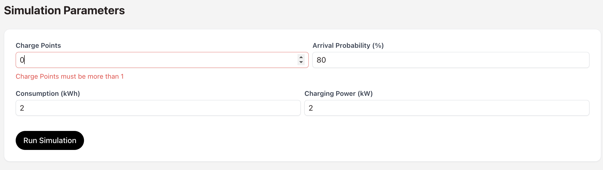
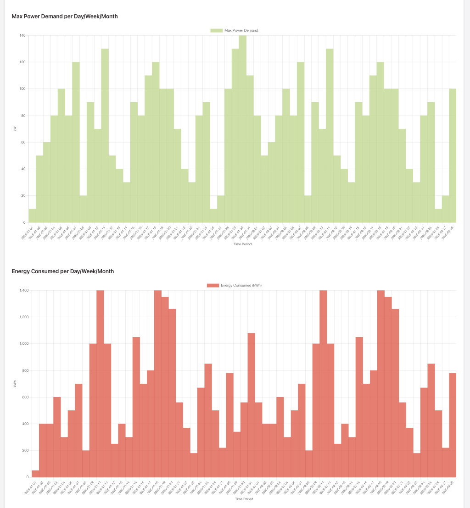
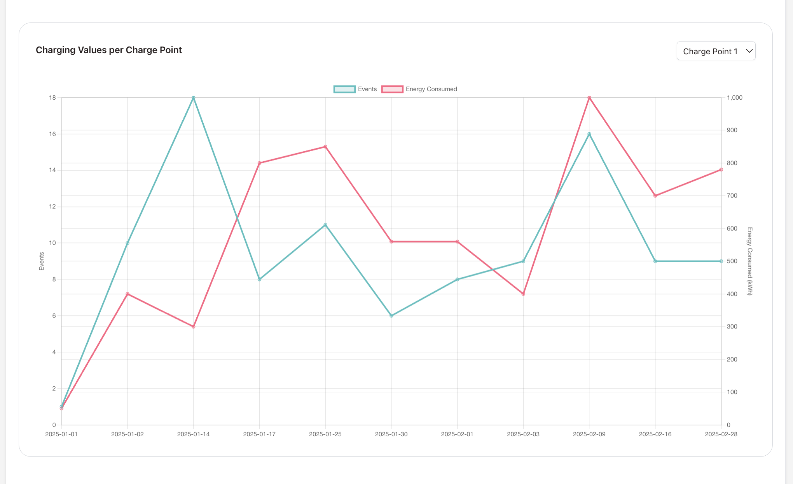
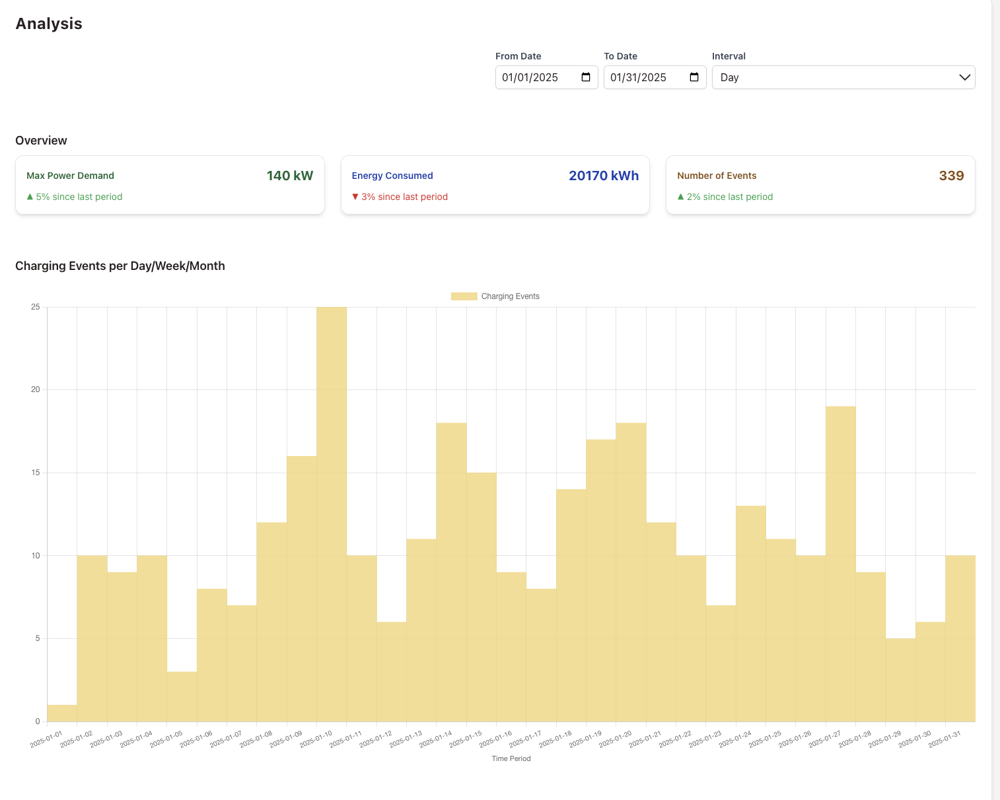
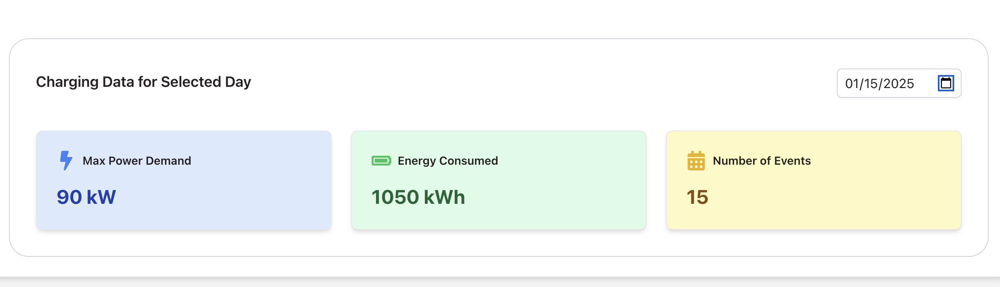

# Charging Simulation Application

Welcome to the **Charging Simulation Application**!🚗⚡ This is a web application designed to help you simulate, manage, and analyze electric vehicle charging scenarios efficiently. It allows you to input various parameters, view simulated results, and gain insights through interactive charts and components! It uses **React**, **Typescript**, **Tailwindcss**, **Zustand** for state management, and **Jest** for testing. Let's get you set up and running locally!

---

## Table of Contents

- [Installation](#installation)
- [Running the Application Locally](#running-the-application-locally)
- [Running Tests](#running-tests)

---

## Installation

To get started, you'll need to have **Node.js** (v18 or above) installed.

1. **Clone the repository**
2. **Install dependencies**:

   ```bash
   yarn install
   ```

## Running the Application Locally

Now that you've installed the dependencies, you're ready to run the app locally.

1. **Start the development server:**:

   ```bash
   yarn run dev
   ```

2. **Access the app::**:

   You should now see the app running locally! 🎉 You can start interacting with different inputs and play around with different charts.

## Running Tests

To run the tests for the application, make sure your environment is ready and the dependencies are installed.

1. **Run the test suite:**:

   ```bash
   yarn run test
   ```

## Description

- I thoroughly enjoyed working on the task and aimed to showcase both functionality and usability in my implementation. If I had more time to create a more realistic and feature-rich project, here’s what I would have done:

- A simulation form to enter data:

  

- Charts for Amount of Charging Events, Energy Consumed and Max Power Demand.

  

- Charging Values Per Charge Point by Type:
  If multiple types of charging points were implemented, I would add separators in the dropdown list based on the type of charging point, making the selection process more organized and intuitive.

  

- Date Range Selection for Simulation:
  I would include "From Date" and "To Date" fields in the simulation parameters to allow users to pass a date range to the backend for generating simulation data. Additionally, I would use the chart library's features, like zoom in/out, to let users dynamically explore specific parts of the simulation data.

  

* Additionally, a few points in the task were unclear to me, so I wanted to share my thoughts:

- Data Source for Simulation:
  It wasn’t clear whether the frontend should handle raw charging point data for simulation or if it would receive calculated or semi-calculated data from the backend. I implemented it as though the simulation inputs are taken on the frontend, sent to the backend, and the simulation results are displayed on the frontend. For demonstration purposes, I hardcoded some JSON data with numbers.

- "An Exemplary Day":
  I wasn’t sure what this term specifically referred to. I implemented something based on my understanding but I’m not certain if it matches what you had in mind.



**Thank you for the opportunity to work on this task, and I look forward to hearing your feedback!**
